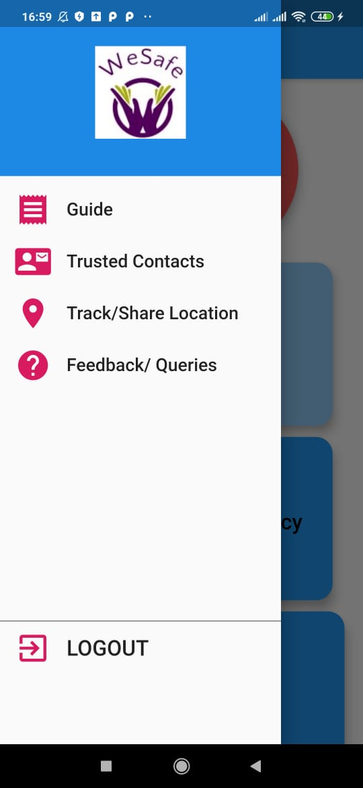

# women_safety_app

The moto regarding this is to create a safe space for every individual. If someone feels unsafe during any point of time. This app would be one stop solution to reach.
The key features provided by this application:
1. SOS
2. Emergency Contacts
3. SMS
4. Current Location.

## The technologies used in the project
1. Flutter
2. Firebase -> Authentication and Database

Installation
------------
 1. Install android studio
 2. Add and install Flutter Plugin
 3. Check dependecies and gradle
 4. Clone and run the project
 5. To build your own database you will need to create one using Firebase

Some Screenshots of the Application
-----------------------------------

Home Screen
----------

Location Screen
---------------

Drawer on the application
-------------------------

SMS functionality
-----------------

Call functionality
------------------

